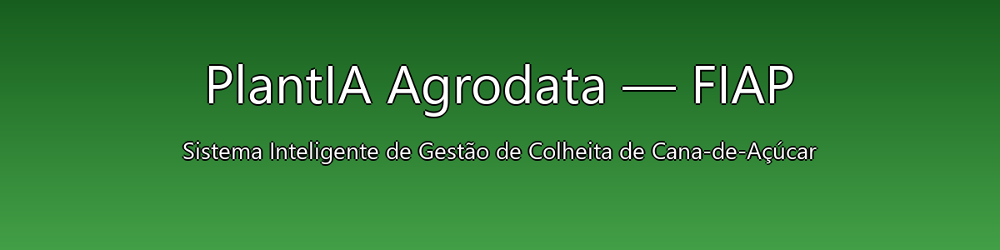

<p align="center">
  
</p>

---

# 🌾 **PlantIA Agrodata - FIAP**
### _Sistema Inteligente de Gestão de Colheita de Cana-de-Açúcar_

📘 Projeto acadêmico desenvolvido na disciplina de **Python (Capítulos 3 a 6)**  
📍 Curso de **Inteligência Artificial - FIAP 2025**

---

## 🧭 Sumário
- [👥 Integrantes do Grupo](#integrantes)
- [🧑‍🏫 Professores](#professores)
- [📘 Sobre o Projeto](#sobre-o-projeto)
- [🎯 Objetivo](#objetivo)
- [⚙️ Funcionalidades](#funcionalidades)
- [🗂️ Estrutura do Projeto](#estrutura-projeto)
- [📁 Estrutura de Pastas (FIAP)](#estrutura-de-pastas-fiap)
- [▶️ Como Executar o Sistema](#como-executar)
- [🧠 Integração com Banco de Dados Oracle (FIAP)](#integração-com-banco-de-dados-oracle-fiap)
- [📊 Geração de Gráficos](#geração-de-gráficos)
- [🧩 Demonstração do Menu Principal](#demonstração-do-menu-principal)
- [🗃 Histórico de Lançamentos](#histórico-de-lançamentos)
- [👨‍💻 Autores e Créditos](#autores-e-créditos)
- [📜 Licença](#licenca)


---

## 👥 Integrantes do Grupo S <a name="integrantes"></a>

| Nome | RM |
|------|----|
| [**Leno Siqueira**](https://www.linkedin.com/in/leno-siqueira-36789544) | **RM567893** |
| [**Fred Villagra**](https://www.linkedin.com/in/federico-villagra-97378838a) | **RM567187** |
| [**Paulo Benfica**](https://www.linkedin.com/in/paulo-benfica-76057a7b) | **RM567648** |
| [**Maria Mendes**](https://www.linkedin.com/in/andr%C3%A9a-mendes-b8959238a) | **RM568563** |
| [**Mateus Lima**](https://www.linkedin.com/in/math-penteado-1b4807200) | **RM568518** |

---

## 🧑‍🏫 Professores: <a id="professores"></a>

**Tutor(a)**  
- [**Sabrina Otoni**](https://www.linkedin.com/in/sabrina-otoni-22525519b)

**Coordenador(a)**  
- [**André Godoi**](https://www.linkedin.com/company/inova-fusca)

---

## 📘 Sobre o Projeto <a id="sobre-o-projeto"></a>

O **PlantIA Agrodata** é um sistema desenvolvido em **Python** com foco no **agronegócio**,  
voltado ao **monitoramento e análise de dados da colheita de cana-de-açúcar**.  

O sistema integra análise de dados, automação de processos e conexão real com o banco de dados **Oracle Cloud (FIAP)**.

💡 Este projeto une conceitos de:
- Inteligência Artificial aplicada ao Agronegócio  
- Estruturas de Dados em Python  
- Persistência com arquivos JSON e Oracle  
- Visualização analítica com **Matplotlib**

---

## 🎯 Objetivo <a id="objetivo"></a>

Criar uma ferramenta simples e didática para:
- Monitorar colheitas de cana-de-açúcar  
- Calcular perdas e produtividade automaticamente  
- Armazenar dados em JSON e no Oracle Database  
- Gerar gráficos analíticos para suporte à decisão  

---

## ⚙️ Funcionalidades <a id="funcionalidades"></a>

| Nº | Funcionalidade | Descrição |
|----|----------------|-----------|
| 1️⃣ | **Cadastro de Colheita** | Inserção manual de dados de colheita |
| 2️⃣ | **Cálculo de Perdas** | Cálculo automático da perda (%) |
| 3️⃣ | **Resumo Analítico** | Exibe médias e totais de produtividade |
| 4️⃣ | **Persistência JSON** | Salva e lê dados localmente |
| 5️⃣ | **Conexão Oracle FIAP** | Envia dados do JSON para o banco Oracle |
| 6️⃣ | **Geração de Gráficos** | Gera e exporta gráficos em PNG |
| 7️⃣ | **Interface CLI** | Menu intuitivo via terminal |

---

## 🗂️ Estrutura do Projeto <a name="estrutura"></a>
```
plantia-agrodata/
│
├── src/
│   ├── main.py
│   ├── coleta_dados.py
│   ├── analise_dados.py
│   ├── graficos.py
│   ├── persistencia.py
│   └── persistencia_oracle.py
│
├── data/
│   └── colheita.json
│
├── assets/
│   └── img/
│       ├── banner_plantia.png
│       ├── media_perda_por_campo.png
│       └── serie_perda_field_101.png
│
└── README.md
```

---

## 📁 Estrutura de Pastas <a id="estrutura-de-pastas-fiap"></a>

Dentre os arquivos e pastas presentes na raiz do projeto, definem-se:

| Pasta / Arquivo | Descrição |
|------------------|-----------|
| **.github/** | Arquivos de configuração do GitHub para automação e integração contínua. |
| **assets/** | Contém imagens, banners e outros elementos visuais. |
| **config/** | Arquivos de configuração usados para definir parâmetros e ajustes do projeto. |
| **document/** | Documentos gerais do projeto e relatórios. Subpasta `other/` para anexos complementares. |
| **scripts/** | Scripts auxiliares (ex: backup, deploy, migração de banco). |
| **src/** | Código-fonte principal do sistema desenvolvido nas fases do projeto. |
| **README.md** | Guia e explicação geral sobre o projeto. |

---

## ▶️ Como Executar o Sistema <a name="execucao"></a>

### Pré-requisitos:
- Python 3.11+  
- Oracle Database (ou conta Oracle FIAP)  
- Pacotes do `requirements.txt`

### Instalação:
```bash
pip install -r requirements.txt
```

### Execução:
```bash
python src/main.py
```

**Menu Principal:**
```
=== PlantIA Agrodata — Gestão de Colheita (FIAP) ===
1) Registrar colheita
2) Resumo por campo (field_id)
3) Resumo geral
4) Salvar dados em JSON
5) Gráficos (mostrar/salvar PNG)
6) Enviar JSON ao Oracle
0) Sair
```

---

## 🧠 Integração com Banco de Dados Oracle (FIAP) <a id="integração-com-banco-de-dados-oracle-fiap"></a>

O PlantIA integra-se ao banco **Oracle Cloud (FIAP)** para armazenar registros de colheitas.

### Teste de Conexão:
```bash
python src/test_oracle.py
```
✅ Resultado esperado:
```
✅ Conexão bem-sucedida com o Oracle (FIAP)!
🔹 Mensagem: PlantIA conectado à FIAP!
🔒 Conexão encerrada.
```

---

## 📊 Geração de Gráficos <a id="geração-de-gráficos"></a>

### Média de perda por campo:
`assets/img/media_perda_por_campo.png`

### Série temporal (exemplo: field_id = 101):
`assets/img/serie_perda_field_101.png`

💡 Os gráficos são salvos automaticamente em `assets/img/`.

---

## 🧩 Demonstração do Menu Principal <a id="demonstração-do-menu-principal"></a>
```
=== PlantIA Agrodata — Gestão de Colheita (FIAP) ===
1) Registrar colheita
2) Resumo por campo (field_id)
3) Resumo geral
4) Salvar dados em JSON
5) Gráficos (mostrar/salvar PNG)
6) Enviar JSON ao Oracle
0) Sair
```
---

## 🗃 Histórico de Lançamentos <a id="histórico-de-lançamentos"></a>

| Versão    | Data       | Descrição                                             |
| --------- | ---------- | ----------------------------------------------------- |
| **1.0.0** | 14/10/2025 | Entrega final FIAP: JSON + Gráficos + Oracle (UPSERT) |
| **0.4.0** | 12/10/2025 | Persistência Oracle/JSON e testes                     |
| **0.3.0** | 10/10/2025 | Menu principal e cálculo de perdas                    |
| **0.2.0** | 08/10/2025 | Estrutura de pastas, coleta e validações              |
| **0.1.0** | 06/10/2025 | Kickoff do projeto e setup inicial                    |

---

## 👨‍💻 Autores e Créditos <a id="autores-e-créditos"></a>
**Desenvolvido por:**
  
👤 **Leno Siqueira** – `lnosiqueira@gmail.com`

👤 **Fred Villagra** – `federicoenriquevillagra@gmail.com`

👤 **Paulo Benfica** – `paulo.benfica@outlook.com`

👤 **Maria Mendes** – `mdea.mendes@gmail.com`

👤 **Mateus Lima** – `mateusstockcar@gmail.com`
  
📘 **FIAP — Faculdade de Informática e Administração Paulista**  
📅 **Ano:** 2025  
📚 **Curso:** Inteligência Artificial  

---

## 📜 Licença <a name="licenca"></a>
Este projeto está licenciado sob a **Licença MIT** — uso livre para fins acadêmicos e de aprendizado.  
© 2025 — FIAP / PlantIA Agrodata