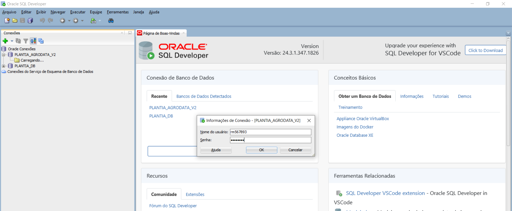
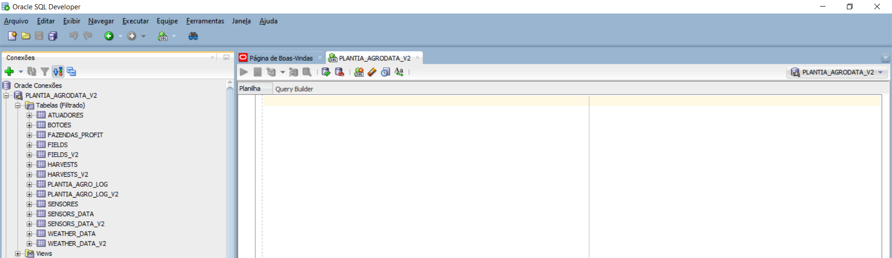
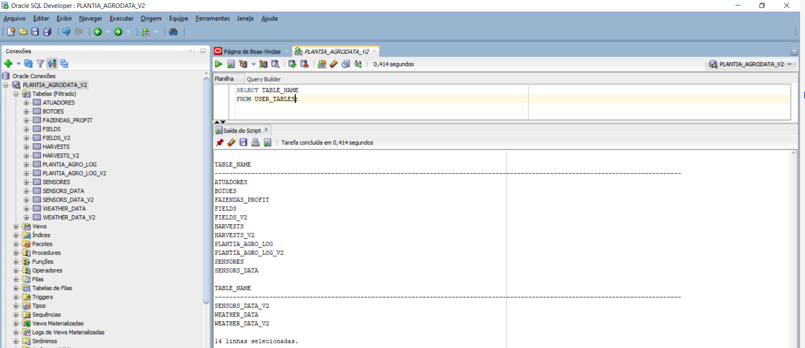
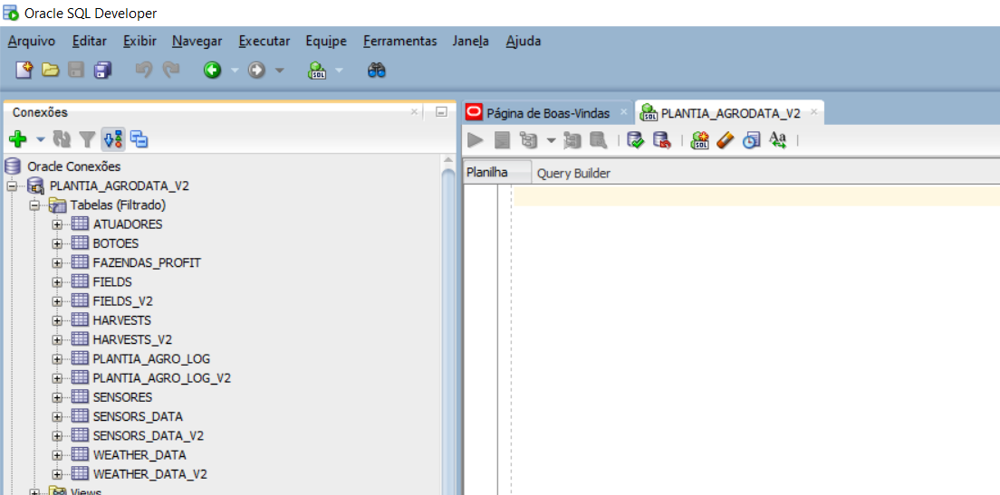
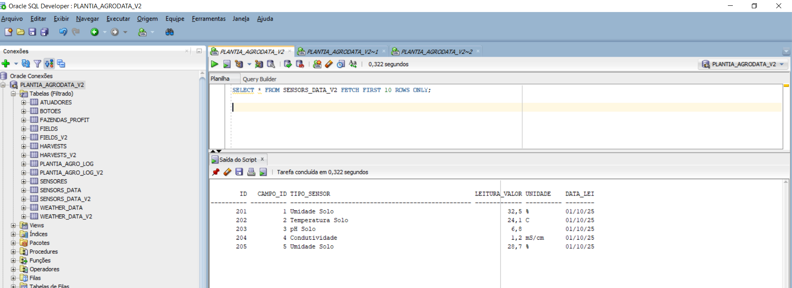
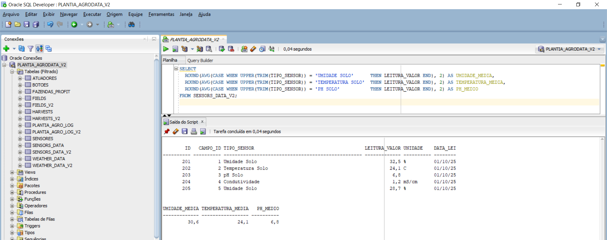
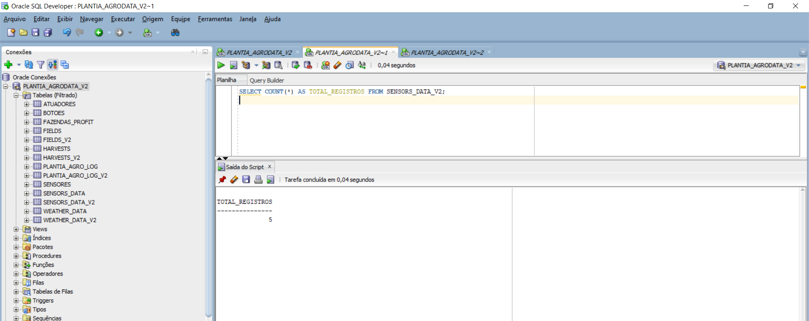

<p align="center">
  
</p>

---

# 🌱 PlantIA Agrodata – Sistema Inteligente de Plantio Sustentável com IoT e Oracle Cloud

Projeto FIAP – **Fase 3 (Etapas de uma Máquina Agrícola)**. Este repositório consolida **integração IoT (ESP32/Wokwi)**, **persistência Oracle**, **API FastAPI** e **evidências** para avaliação.

## 📑 Sumário
- [Descrição Geral](#descrição-geral)
- [Arquitetura Técnica](#arquitetura-técnica)
- [Banco Oracle — Passo a Passo e Evidências](#banco-oracle--passo-a-passo-e-evidências)
- [Integração IoT — ESP32/Wokwi → Oracle](#integração-iot--esp32wokwi--oracle)
- [Como Executar (CLI / API / Dashboard)](#como-executar-cli--api--dashboard)
- [Estrutura de Pastas](#estrutura-de-pastas)
- [Integrantes do Grupo S](#integrantes-do-grupo-s)
- [Professores](#professores)
- [Histórico de Lançamentos](#histórico-de-lançamentos)
- [Créditos e Licença](#créditos-e-licença)

---

## Descrição Geral
O **PlantIA Agrodata** é um **sistema inteligente de plantio e monitoramento**. Ele captura leituras **(umidade do solo, temperatura, pH)** via **ESP32 (Wokwi)**, envia para uma **API Python** e persiste no **Oracle** para análises e dashboards.

---

## Arquitetura Técnica
```
ESP32 (Wokwi) ── Leituras (Temp/Umidade/pH)
        │
        ▼
API Python (FastAPI) ── Validação/Transformação
        │
        ▼
Banco de Dados (Oracle) ── Consultas/Estatísticas
        │
        ▼
Dashboard (Streamlit) ── KPIs e Visualizações
```

---

## Banco Oracle — Passo a Passo e Evidências

### 1) Conexão ao Banco


### 2) Tabelas do Schema


### 3) Listagem de Tabelas (USER_TABLES)
```sql
SELECT TABLE_NAME
FROM USER_TABLES;
```


### 4) Estrutura da Tabela Principal


### 5) Amostra de Registros


### 6) Consultas Estatísticas



> Evidências em PDF: [`document/docs/oracle_evidences.pdf`](document/docs/oracle_evidences.pdf).

---

## Integração IoT — ESP32/Wokwi → Oracle


Fluxo resumido:
```
ESP32 (Wokwi) → JSON → FastAPI → cx_Oracle → SENSORS_DATA_V2
```

**Exemplo de consulta de médias (robusta a maiúsc./espaços):**
```sql
SELECT
  ROUND(AVG(CASE WHEN UPPER(TRIM(TIPO_SENSOR))='UMIDADE SOLO'     THEN LEITURA_VALOR END),2) AS UMIDADE_MEDIA,
  ROUND(AVG(CASE WHEN UPPER(TRIM(TIPO_SENSOR))='TEMPERATURA SOLO' THEN LEITURA_VALOR END),2) AS TEMPERATURA_MEDIA,
  ROUND(AVG(CASE WHEN UPPER(TRIM(TIPO_SENSOR))='PH SOLO'          THEN LEITURA_VALOR END),2) AS PH_MEDIO
FROM SENSORS_DATA_V2;
```

---

## Como Executar (CLI / API / Dashboard)

### 1) Preparar ambiente
```bash
# criar venv (Windows)
python -m venv .venv
.venv\Scripts\activate

# dependências
pip install -r requirements.txt

# (opcional) variáveis de ambiente (.env)
# ORACLE_USER=RMxxxxx
# ORACLE_PASS=DDMMYY
# ORACLE_DSN=oracle.fiap.com.br:1521/orcl
```

### 2) Executar CLI
```bash
python src/main.py
```

### 3) Executar API (FastAPI)
```bash
uvicorn src.api:app --reload
```
- Abra o **Swagger** em: **http://127.0.0.1:8000/docs**
- Endpoint típico: `POST /oracle/sync`, `GET /sensores/media?tipo=UMIDADE SOLO`

### 4) Abrir o Dashboard (se disponível)
```bash
streamlit run dashboard/app.py
```
- Acesse: **http://localhost:8501**

> **Dica:** Se estiver usando **PowerShell**, execute `Set-ExecutionPolicy -Scope CurrentUser RemoteSigned` se houver bloqueio ao ativar a venv.

---

## Estrutura de Pastas
```
plantia-agrodata/
├─ assets/
│  └─ img/                 # prints e banner
├─ document/
│  └─ docs/                # evidências (PDF)
├─ src/                    # código-fonte (CLI/API)
├─ scripts/                # utilitários
├─ requirements.txt
└─ README.md
```

---

## Integrantes do Grupo S
| Nome | RM |
|------|----|
| Leno Siqueira | RM567893 |
| Fred Villagra | RM567187 |
| Paulo Benfica | RM567648 |
| Maria Mendes | RM568563 |
| Mateus Lima | RM568518 |

---

## Professores
- **Tutor(a):** Sabrina Otoni  
- **Coordenador(a):** André Godoi

---

## Histórico de Lançamentos
| Versão | Data | Descrição |
|---|---|---|
| 2.0.0 | 12/11/2025 | Evolução para **Sistema Inteligente de Plantio** (ESP32/Wokwi + Oracle + evidências) |
| 1.0.0 | 14/10/2025 | Entrega FIAP: JSON + Gráficos + Oracle (UPSERT) |

---

## Créditos e Licença
© 2025 — FIAP / PlantIA Agrodata  
Licença **MIT** — uso livre para fins acadêmicos e de aprendizado.


## https://github.com/lnosiqueira/plantia-agrodata
## https://youtu.be/9Y8mk1WcBII
