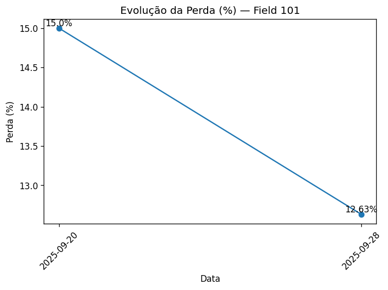

<!-- Banner / Título centralizado -->
<p align="center">
  
</p>

<h1 align="center">🌾 PlantIA Agrodata — FIAP</h1>
<p align="center">
  Sistema de Gestão Inteligente de Colheita de Cana-de-Açúcar
</p>

<p align="center">
  <a href="https://img.shields.io/badge/status-ativo-success?style=for-the-badge">
    
  </a>
  <a href="https://img.shields.io/badge/python-3.11%2B-blue?style=for-the-badge">
    
  </a>
  <a href="https://img.shields.io/badge/oracle-UPSERT-orange?style=for-the-badge">
    
  </a>
  <a href="https://img.shields.io/badge/licen%C3%A7a-MIT-black?style=for-the-badge">
    
  </a>
</p>

---

> ### 💡 Sumário rápido
> - [Sobre](#-sobre-o-projeto) ・ [Objetivo](#-objetivo) ・ [Estrutura](#-estrutura-do-repositório) ・ [Instalação](#-instalação)  
> - [Como executar](#%EF%B8%8F-como-executar) ・ [Gráficos](#-gráficos) ・ [JSON Exemplo](#-json-de-exemplo)  
> - [Integração Oracle (FIAP)](#%EF%B8%8F-integração-com-oracle-fiap) ・ [FAQ Oracle](#-faq-oracle)  
> - [Requisitos atendidos (Cap. 3–6)](#-requisitos-cap-3–6) ・ [Entrega](#-entrega-fiap) ・ [Autor](#-autor)

---

## 📘 Sobre o Projeto
O **PlantIA Agrodata** é um sistema em **Python** para **monitoramento e análise** da colheita de cana-de-açúcar.  
Aplicamos conceitos **Agrotech**: registros, cálculo de perdas, **gráficos** e **persistência** em **JSON** e **Oracle** (com **UPSERT** — sem duplicar).

**Capítulos atendidos (3–6):**
- Subalgoritmos (funções/procedimentos)
- Estruturas de dados (lista, tupla, dicionário, “tabela de memória”)
- Arquivos (texto/JSON)
- Banco de Dados (Oracle)

---

## 🧠 Objetivo
- Registrar colheitas (manual/mecânica), com validações  
- Calcular **perdas (%)** e gerar **resumos**  
- Persistir dados em **JSON** e **Oracle**  
- Exibir **gráficos** de médias e séries temporais

---

## 🗂️ Estrutura do Repositório
```text
plantia-agrodata/
│
├── src/
│   ├── main.py                 # Menu CLI principal
│   ├── coleta_dados.py         # Entrada e validação
│   ├── analise_dados.py        # Cálculos e resumos
│   ├── graficos.py             # Mostrar/salvar PNG
│   ├── persistencia.py         # JSON (ler/gravar)
│   ├── persistencia_oracle.py  # Oracle (criar tabela, UPSERT, listar)
│   └── test_oracle.py          # Teste isolado de conexão
│
├── data/
│   └── colheita.json           # Dataset de exemplo
│
├── docs/
│   ├── img/
│   │   ├── banner_plantia.png
│   │   ├── media_perda_por_campo.png
│   │   └── serie_perda_field_101.png
│   └── relatorio.md
│
├── requirements.txt
├── LICENSE
└── README.md
⚙️ Instalação
bash
Copiar código
pip install -r requirements.txt
Recomendado (Windows): usar venv

bash
Copiar código
python -m venv .venv
.venv\Scripts\activate
pip install -r requirements.txt
▶️ Como executar
bash
Copiar código
python src/main.py
Menu:

java
Copiar código
=== PlantIA Agrodata — Gestão de Colheita (FIAP) ===
1) Registrar colheita
2) Resumo por campo (field_id)
3) Resumo geral
4) Salvar dados em JSON
5) Gráficos (mostrar/salvar PNG)
6) Enviar JSON ao Oracle
0) Sair
📊 Gráficos
Média de perda (%) por campo

<p></p>
Série temporal de perda por field_id

<p></p>
Dica: use a opção 5 do menu para mostrar ou salvar PNG automaticamente em docs/img/.

💾 JSON de exemplo
data/colheita.json

json
Copiar código
[
  {"field_id": 101, "method": "mecanica", "area_ha": 12.5, "loss_percentage": 3.2, "date": "2025-10-14"},
  {"field_id": 102, "method": "manual",   "area_ha": 10.0, "loss_percentage": 1.8, "date": "2025-10-14"},
  {"field_id": 103, "method": "mecanica", "area_ha": 15.0, "loss_percentage": 2.7}
]
date é opcional — se ausente, a integração com Oracle usa hoje (TRUNC(SYSDATE)).

☁️ Integração com Oracle (FIAP)
1) Teste de conexão (isolado)
Edite src/test_oracle.py com seu usuário/senha/DSN (FIAP) e rode:

bash
Copiar código
python src/test_oracle.py
Saída esperada:

java
Copiar código
✅ Conexão bem-sucedida com o Oracle (FIAP)!
🔹 Mensagem: PlantIA conectado à FIAP!
🔒 Conexão encerrada.
2) Variáveis de ambiente (recomendado)
bat
Copiar código
setx ORACLE_USER "SEU_USUARIO_FIAP"
setx ORACLE_PASSWORD "SUA_SENHA_FIAP"
setx ORACLE_DSN "oracle.fiap.com.br:1521/ORCL"
Feche e reabra o terminal. O persistencia_oracle.py lê essas variáveis.

3) Enviar JSON ao Oracle (menu)
No main.py, escolha a opção 6:

java
Copiar código
✅ N registros upsert (sem duplicar).
Se rodar de novo, não duplica: usa MERGE com chave natural (field_id, TRUNC(data_colheita)).

<details> <summary><b>Como funciona o UPSERT (MERGE)</b></summary>
sql
Copiar código
MERGE INTO colheita c
USING (
  SELECT :field_id AS field_id,
         :tipo_colheita AS tipo_colheita,
         :area_ha AS area_ha,
         :perda AS perda_percent,
         NVL(TO_DATE(:data_str, 'YYYY-MM-DD'), TRUNC(SYSDATE)) AS dt
  FROM dual
) src
ON (c.field_id = src.field_id AND TRUNC(c.data_colheita) = src.dt)
WHEN MATCHED THEN
  UPDATE SET
    c.tipo_colheita = src.tipo_colheita,
    c.area_ha       = src.area_ha,
    c.perda_percent = src.perda_percent
WHEN NOT MATCHED THEN
  INSERT (field_id, tipo_colheita, area_ha, perda_percent, data_colheita)
  VALUES (src.field_id, src.tipo_colheita, src.area_ha, src.perda_percent, src.dt);
</details> <details> <summary><b>Consultas úteis</b></summary>
sql
Copiar código
SELECT id, field_id, tipo_colheita, area_ha, perda_percent, TRUNC(data_colheita) dia
FROM colheita
ORDER BY id DESC FETCH FIRST 10 ROWS ONLY;

SELECT field_id, TRUNC(data_colheita) dia, COUNT(*) qtd
FROM colheita
GROUP BY field_id, TRUNC(data_colheita)
HAVING COUNT(*) > 1;
</details>
❓ FAQ Oracle
ORA-01017 (invalid username/password): confira usuário/senha/DSN (e teste com sqlplus USUARIO/SENHA@oracle.fiap.com.br:1521/ORCL).

ORA-12541 (no listener): servidor/DSN incorreto ou VPN necessária.

ORA-00001 (unique violated): você tem UNIQUE em (field_id, TRUNC(data_colheita)) — use a opção 6 (UPSERT).

🧩 Requisitos (Cap. 3–6)
Subalgoritmos: coleta_dados.py, analise_dados.py, graficos.py, persistencia.py, persistencia_oracle.py

Estruturas de dados: list[dict] (tabela de memória)

Arquivos: JSON (persistencia.py) + data/colheita.json

Banco Oracle: persistencia_oracle.py (criar tabela, UPSERT, listar)

📦 Entrega (FIAP)
python src/main.py → registrar/JSON/gráficos/Oracle

Prints em docs/img/ adicionados ao README

Release/Tag:

bash
Copiar código
git tag -a v1.0-entrega-fiap -m "Entrega PlantIA: JSON + Gráficos + Oracle UPSERT"
git push origin v1.0-entrega-fiap
👤 Autor
Leno Siqueira — FIAP
📧 lnosiqueira@gmail.com

📜 Licença
MIT


---

## Como deixar “idêntico” visualmente
- **Banner**: crie `docs/img/banner_plantia.png` (pode ser um PNG simples com o título).  
- **Prints**: salve os gráficos gerados pelo menu em `docs/img/` com os nomes usados acima.  
- **Badges**: já estão prontos (shields.io); o GitHub renderiza automaticamente.

Se quiser, eu crio um **banner PNG minimalista** (texto branco em fundo verde) e te mando o arquivo pra colocar em `docs/img/banner_plantia.png`. Quer?
